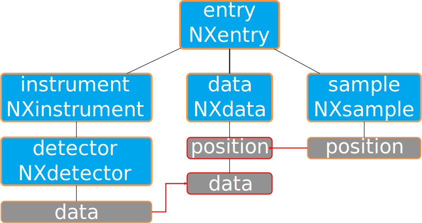
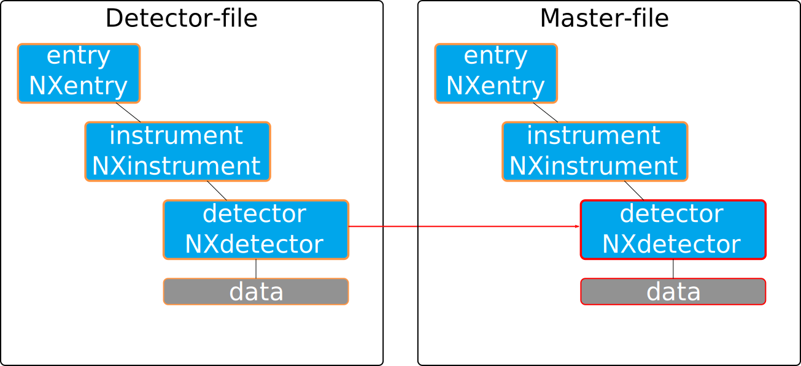

==================
Working with links
==================

Nexus files support two kinds of links 

* *internal* links between objects within the same file
* and *external* links between objects in different files

Both types of links are supported via the :py:func:`link` function. Links are
an appropriate tool to avoid data duplication. A typical application for links
are the fields in the *NXdata* instance below *NXentry*. *NXdata* provides data
recorded during a measurement intended for easy plotting. Virtually all data is
stored already in other locations of the NeXus file. Without links we would
have to copy this data to *NXdata* to make it available to a plotting
procedure which would be an awefull waste of time and space in particular when
the amount of data is getting large. 

With links we can simply provide references to the original data below
*NXdata*. 

In the above example the *data* and *position* field are members of the 
*NXdetector* and *NXsample* group respectively. However, by means of links 
we can make these two fields available as children of the *NXdata* group
without copying data. In this case internal links have been used as all data
resides in the same file. The red lines in the sketch denote the links

For *external*-links the canonical use case is a detector which writes its own
NeXus file with data (we will refer to this file as the *detector*-file). 
All additional data is writen by the control system to a second NeXus file
which we will call *master*-file. To make the detector data available from the
*master*-file we have two possibilities 

* either copy the entire data to the *master*-file 
* or use an *external*-link.

The drawbacks of the former solution are obvious: we would need to copy all the
data to a different file. However, with *external*-links we can do something
like this 

Here the detector group can be accessed from the *master*-file as if it would
be a part of it. The link is totally transparent to the user. 

Internal links
--------------
From the
point of the library interface, internal and external links work exactly the
same, just the path is
different. 

.. code-block:: python
    
    from __future__ import print_function
    import pni.io.nx.h5 as nexus

    f = nexus.open_file("master.nxs",False)
    r = f.root()
    data = nx.get_object(r,"/:NXentry/:NXdata")

    nexus.link("/entry/instrument/detector/data",data,"data")

The :py:func:`link` function creates now a link to the *data* field below
*NXdata* with name *data*. The important thing to note here is that the path
pointing to the link target must not contain elements that consist only of
types. This due to the fact, that the linking feature is provided by the HDF5
library which has no idea about NeXus semantics. 
The object the HDF5 path referes to must not necessarily  exist at link time. 
Alternatively, within a file we can do a link of an existing object. In this
case the above example would look like this

.. code-block:: python
    
    from __future__ import print_function
    import pni.io.nx.h5 as nexus

    f = nexus.open_file("master.nxs",False)
    r = f.root()
    detector = nexus.get_object(r,"/:NXentry/:NXinstrument/:NXdetector/data")
    data = nx.get_object(r,"/:NXentry/:NXdata")

    nexus.link(detector,data,"data")

In this case the object we are linking to must obviously exist in order to make
the call to :py:func:`get_object` successful.

External links
--------------

External links can be done like in the first example but with the filename
section at the beginning of the path 

.. code-block:: python
    
    from __future__ import print_function
    import pni.io.nx.h5 as nexus

    f = nexus.open_file("master.nxs",False)
    r = f.root()
    detector = nexus.get_object(r,"/:NXentry/:NXinstrument/:NXdetector")

    nexus.link("detector.nxs://entry/instrument/detector/data",detector,"data")

For external links relative paths to the file should be used. Otherwise movin
the files to a different file system can cause unresolvable links!
